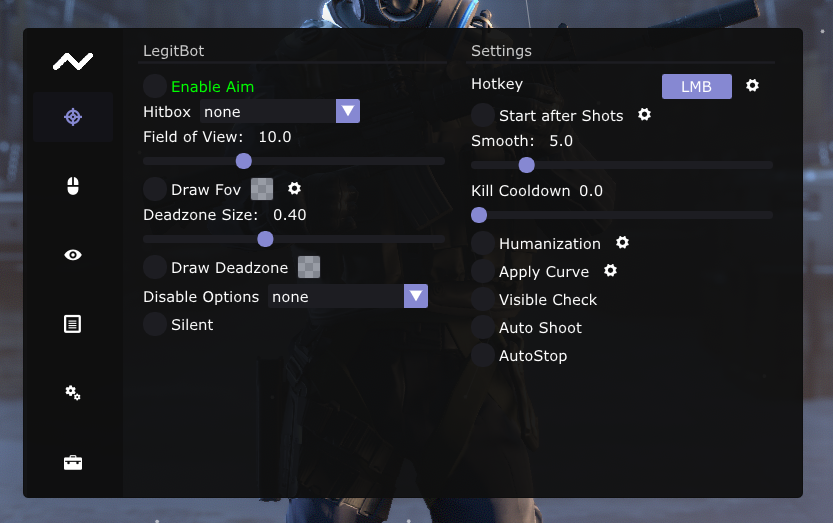
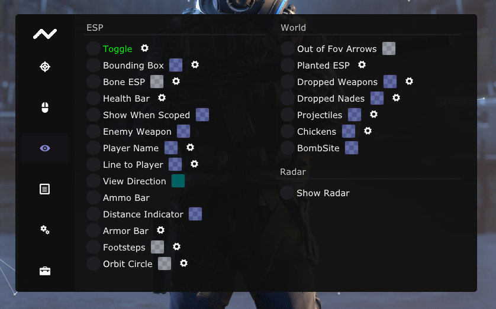
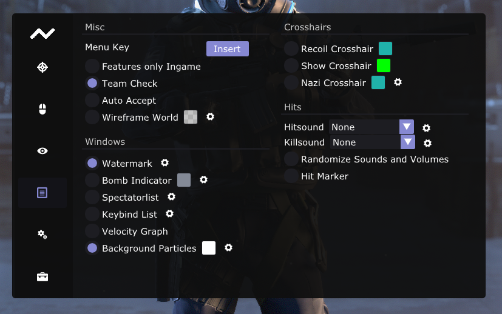
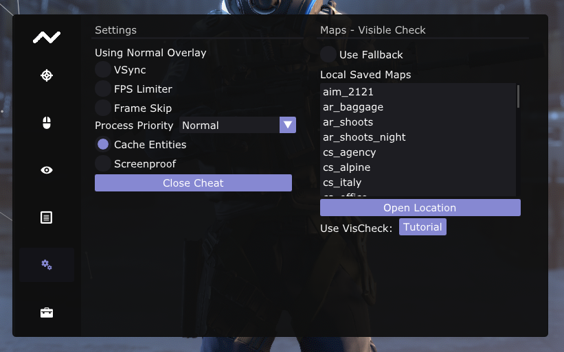
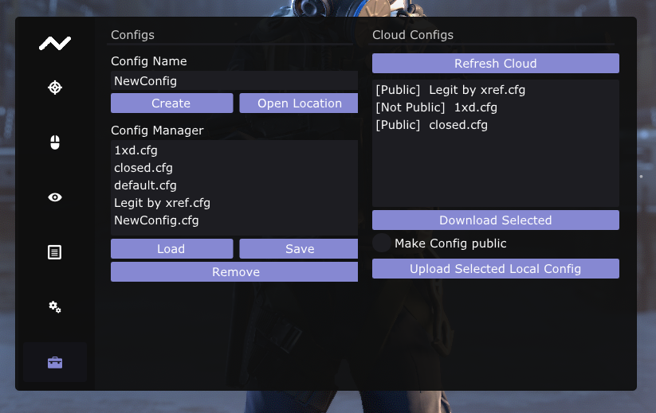

## Public Repositories of [average.wtf](https://average.wtf/)

 

# Links

U can find our offical Gitbook [here](https://cs2-kernel.gitbook.io/cs2-kernel/).

U can find our map files [here](https://mega.nz/file/jqBCQYhQ#diJbm4IS0iMrmiluUM0Yl6gc3whDKPo60r6dYmC938I).

U can find our offical Discord [here](https://discord.com/invite/DsUS6jFby2).

# Featurelist

U can browse our features [here](features.md).

# Menu Screenshots

